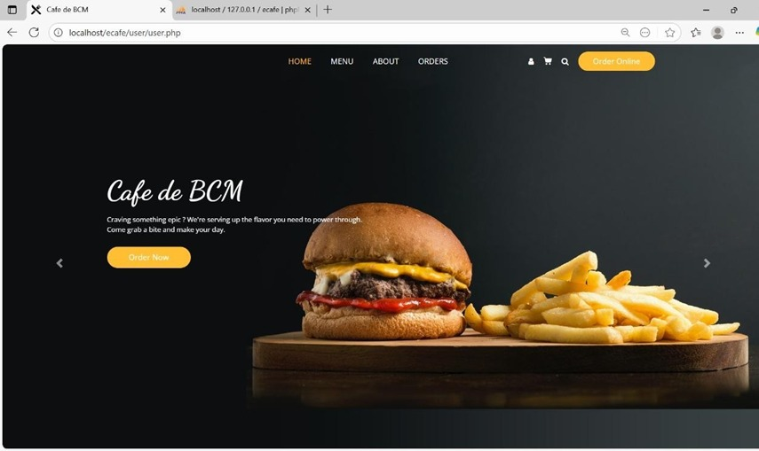
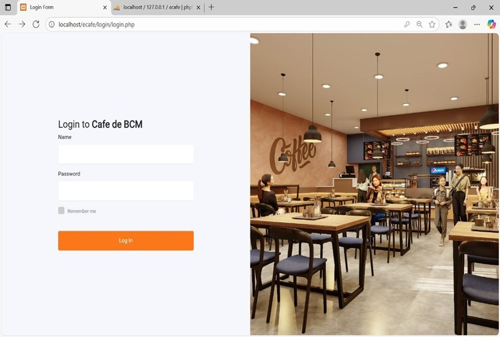
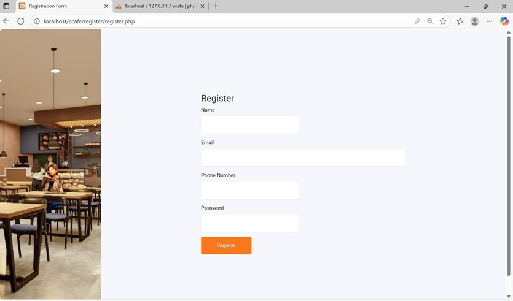
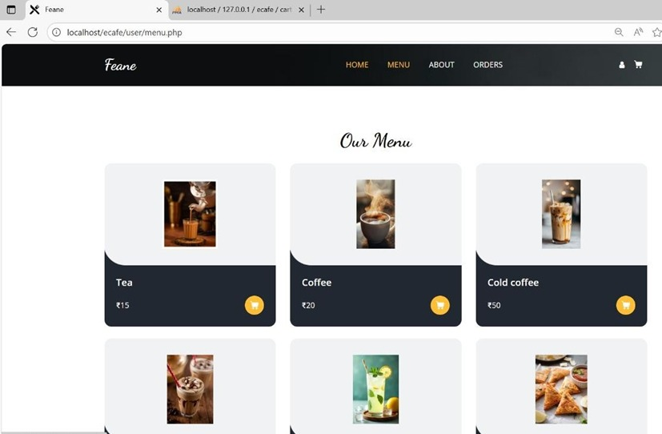
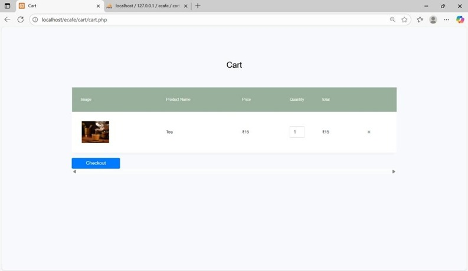
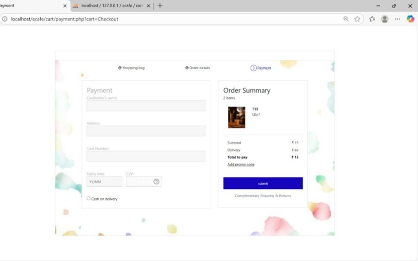
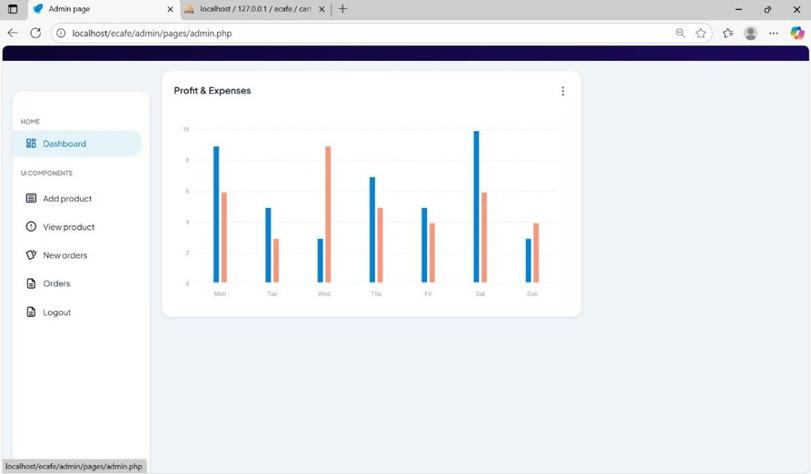
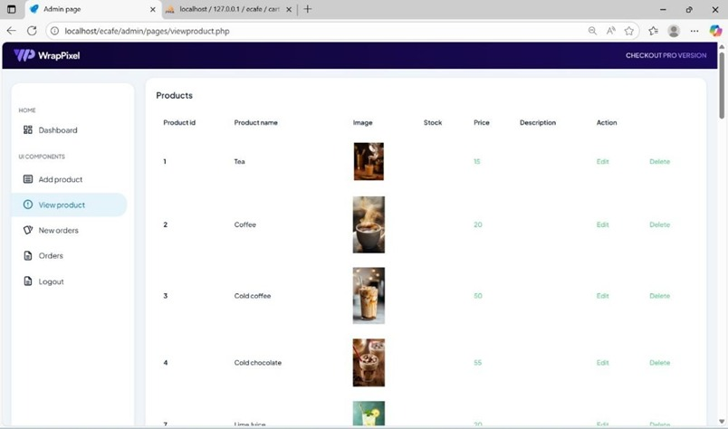
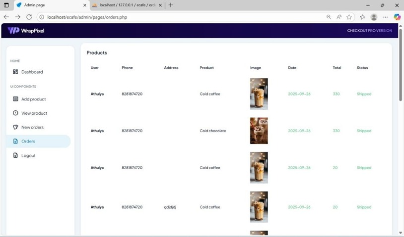

# E-Treat-Smart-Canteen-System
E-Treat is a smart canteen automation system developed using PHP and MySQL. It allows users to browse menus, place orders, and make payments online, while admins manage menu, orders, and sales. Developed as a mini project by Athulya Binu, Aarya Santhosh, Adithya A.S, and Thamara T.S.

## 🎯 Objectives
- Automate traditional canteen operations  
- Reduce waiting time and manual errors  
- Provide a user-friendly ordering system  
- Improve overall customer experience  

## ⚙️ Features

### 👤 User Module
- User registration and login  
- View menu items  
- Place and customize orders  
- Track order history  
- Secure card payment  

### 🛠️ Admin Module
- Manage menu items  
- View and manage orders  
- Track sales and order status  

### ☕ Café Staff Module
- Add product details  
- Update price and stock  
- Manage order processing  

## 🧑‍💻 Technologies Used
- **Frontend:** HTML, CSS, JavaScript  
- **Backend:** PHP  
- **Database:** MySQL  

## 💡 System Highlights
- Real-time order management  
- Secure data handling  
- Easy-to-use interface  
- Efficient database management  

## 🚀 Advantages
- Saves time and effort  
- Reduces human errors  
- Improves service quality  
- Digital record maintenance  

## ⚠️ Limitations
- Requires internet connection  
- Basic UI design  
- Limited payment integration  

## 🔮 Future Enhancements
- Mobile app integration (Flutter)  
- Online payment gateways (UPI, Razorpay)  
- AI-based recommendation system  
- Notification system  

## 📷 Screenshots

### 🏠 Home Page

### 🔐 Login Page

### 📝 Register Page

### 📋 Menu Page

### 🛒 Cart Page

### 💳 Payment Page

### 👨‍💼 Admin Dashboard

### 📦 Admin - View Products

### 📑 Admin - Orders

## 👩‍💻 Authors
- Athulya Binu  
- Aarya Santhosh  
- Adithya A.S  
- Thamara T.S  
